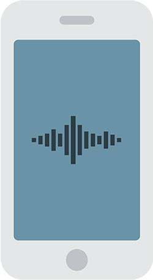

# react-native-media



A react-native library to play and record audio on both iOS and android with no callbacks.

## Specifications

### iOS

Built with AVAudioPlayer and AvAudioRecorder.

### android

Built with MediaPlayer and MediaRecorder.

## Installation

Install the package:

```javascript
npm install react-native-media --save
```

or

```javascript
yarn add react-native-media
```

### Automatic

Link the native code with your RN application:

```javascript
react-native link react-native-media
```

### Manual

[TODO]

## Player

|Description|Android|iOS
---|---|---
|Load|✓|✓
|Play|✓|✓
|Load and Play|✓|✓
|Pause|✓|✓
|Resume|✓|✓
|Stop|✓|✓
|Seek Time|✓|✓
|Track current time|✓|✓
|Get Volume|✓|✓
|Set System Volume|
|Set Loops (-1 for infinite)|✓|✓
|Turn speakers on/off|✓|✓
|Set audio routes|✓|✓
|Mute|✓|
|Dim screen by proximity on/off|✓|✓
|Sleep mode on/off|✓|✓

## Recorder
Description ✓ | iOS | Android
---|---|---
Prepare (Bitrate, SampleRate, Channels, AudioQuality, AudioEncoding, Encoder)
Start
Stop


## Events
Description ✓ | iOS | Android
---|---|---
|Audio finished play
|Volume changed
|System volume changed
|Wired headset
|Audio focus changed
|Silent mode changed (iOS only)
